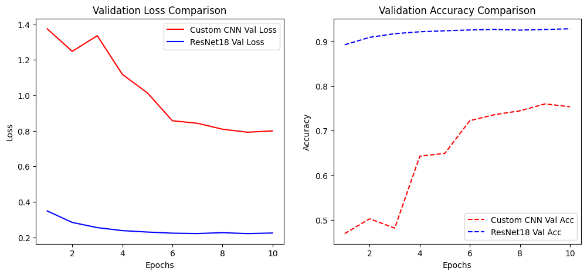

# Ταξινόμηση Δορυφορικών Εικόνων Χρήσης Γης με το EuroSAT Dataset

**Μάθημα:** Βαθιά Μάθηση (MSc Artificial Intelligence & Visual Computing)  
**Framework:** PyTorch  
**Dataset:** EuroSAT (RGB έκδοση, 27.000 εικόνες, 10 κλάσεις)

---

## 1. Περιγραφή του Προβλήματος
Σκόπος της παρούσας εργασίας είναι η αξιολόγηση και η συγκριτική ανάλυση δύο διαφορετικών αρχιτεκτονικών Βαθιάς Μάθησης για την ταξινόμηση δορυφορικών δεδομένων Sentinel-2. Το EuroSAT περιλαμβάνει 10 διαφορετικές κλάσεις (Forest, River, Highway, Residential, Pasture, HerbaceousVegetation, Industrial, AnnualCrop, PermanentCrop, SeaLake).

## 2. Μεθοδολογία & Αρχιτεκτονικές
Υλοποιήθηκαν και συγκρίθηκαν δύο διαφορετικά μοντέλα:
1. **Custom CNN (From Scratch):** Ένα ρηχό συνελικτικό δίκτυο 3 επιπέδων (Conv + BatchNorm + ReLU + MaxPool) με ένα Fully Connected επίπεδο και Dropout (0.5) στο τέλος για την αποφυγή της υπερεκπαίδευσης.
2. **ResNet18 (Transfer Learning):** Αξιοποίηση του προεκπαιδευμένου μοντέλου ResNet18 (στο ImageNet). Τα βάρη των συνελικτικών επιπέδων "παγώθηκαν" (frozen features) και εκπαιδεύτηκε από την αρχή μόνο το τελικό επίπεδο ταξινόμησης (Fully Connected layer) προσαρμοσμένο στις 10 κλάσεις μας.

### Τεχνικές Data Augmentation:
Για την ενίσχυση της γενικευτικής ικανότητας των μοντέλων εφαρμόστηκαν:
* Random Horizontal & Vertical Flips (καθώς οι δορυφορικές εικόνες δεν χάνουν το νόημά τους αν αναστραφούν).
* Random Rotation (έως 15 μοίρες).
* Κανονικοποίηση (Normalization) με βάση τα στατιστικά του ImageNet.

## 3. Υπερπαράμετροι Εκπαίδευσης (Hyperparameters)
* **Συνάρτηση Απώλειας:** Cross-Entropy Loss
* **Batch Size:** 32
* **Epochs:** 10
* **Optimizers:** Adam (Custom CNN, lr=0.001) / SGD με Momentum (ResNet18, lr=0.001, momentum=0.9)
* **Learning Rate Scheduler:** StepLR (μείωση κατά 0.1 ανά 5 epochs)

## 4. Αποτελέσματα & Συγκριτική Ανάλυση

| Μοντέλο | Training Loss | Validation Loss | Validation Accuracy |
| :--- | :---: | :---: | :---: |
| **Custom CNN (From Scratch)** | 1.1118 | 1.1293 | **60.33%** |
| **ResNet18 (Transfer Learning)** | 0.6136 | 0.5847 | **79.91%** |

### Καμπύλες Εκπαίδευσης & Απώλειας

### 🧠 Ανάλυση & Συμπεράσματα Πειραμάτων
1. **Η Υπεροχή του Transfer Learning:** Το μοντέλο ResNet18 επέδειξε εξαιρετική σταθερότητα και ταχύτητα σύγκλισης, αγγίζοντας το 79.91% accuracy. Η καμπύλη απώλειάς του μειώνεται ομαλά, επιβεβαιώνοντας ότι οι προεκπαιδευμένες δομές του ImageNet είναι εξαιρετικά συμβατές με τις ιδιαιτερότητες των δορυφορικών λήψεων.
2. **Ανάλυση Custom CNN & Διακυμάνσεις:** Το Custom CNN έφτασε σε ακρίβεια 60.33%. Στο γράφημα του Validation Loss παρατηρείται μια προσωρινή αστάθεια (spike) στην Epoch 3. Το φαινόμενο αυτό οφείλεται στην τυχαία αρχικοποίηση των βαρών και σε πιθανή απότομη μεταβολή των κλίσεων (gradients) κατά τη διάρκεια του optimization. Η άμεση εξομάλυνση της καμπύλης στις επόμενες epochs αποδεικνύει τη στιβαρότητα του αλγορίθμου Adam και τη συνεισφορά του StepLR scheduler στη σταθεροποίηση της μάθησης.

## 5. Οδηγίες Εκτέλεσης
1. Εγκαταστήστε τις απαραίτητες βιβλιοθήκες:  
   `pip install -r requirements.txt`
2. Εκτελέστε το Jupyter Notebook:  
   `jupyter notebook Deep_Learning_EuroSAT.ipynb`
